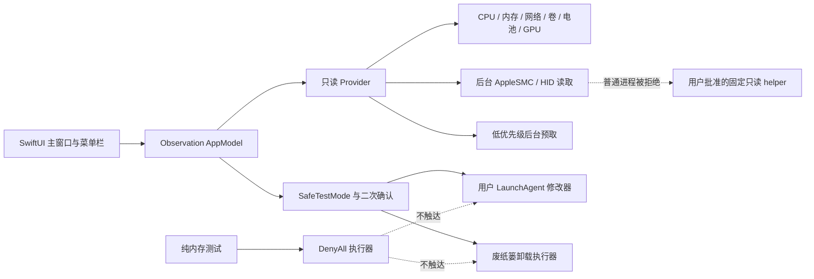

# TraceHalo 实现与验收记录

> 记录日期：2026-08-07
>
> 平台：macOS 14+，SwiftUI / Swift 6.2
>
> 产品性质：基于功能分析重新设计的原创实现，不复用 Sensei 私有代码、商标素材或授权机制

## 1. 结论

TraceHalo 已形成可编译、可运行、可打包的原生 macOS 应用。产品明确删除了许可证激活、磁盘清理和 SSD TRIM 三个能力域，其余能力按“公开 API 能可靠读取则展示；无法可靠读取则显示不可用；系统修改必须二次确认并经过安全边界”的原则实现。

当前不是对 Sensei 私有后台服务和底层硬件驱动的逐字段复刻。TraceHalo 已独立实现只读 AppleSMC/HID 传感器读取与可选只读服务，但没有稳定数据源的 GPU 底层计数器、NVMe 详细指标、卷级实时 I/O、睡眠唤醒原因等字段仍不会伪造。

## 2. 功能实现矩阵

| 功能域 | 当前实现 | 边界 |
|---|---|---|
| 系统概览 | CPU、GPU、内存占用、存储、电池、进程、网络、设备身份、运行时间 | 缺失指标显示 `—` 或不可用 |
| 菜单栏监视器 | Sensei 风格 CPU 面积图、RAM/SSD 量表与 CPU 温度状态区；完整/精简/仅图标三模式；显隐、指标、样式、排序、增删与实时预览；八卡片弹窗、双列详情和六个快捷入口 | 配置持久化；弹窗固有尺寸回归已覆盖“只显示快捷栏”根因；真实 OS 状态项点击仍需用户做一次最终确认 |
| 启动优化 | 后台预取 Login Item、Launch Agent、Launch Daemon；默认显示第三方建议关注项，也可查看全部 | 惰性列表避免一次创建 900+ 行；仅当前用户 `~/Library/LaunchAgents` 可确认后修改 |
| 应用卸载 | 后台扫描 `/Applications` 和 `~/Applications`；按选中应用读取用户 Library 关联候选 | 不递归统计应用包/目录体积，未知值显示“未统计”；候选项默认不选 |
| 存储 | 卷容量、格式、加密、只读、可移动、SMART 总体状态及 IOKit 物理块设备实时 I/O | 累计值是驱动实例启动以来计数；不伪造卷级拆分、寿命百分比或详细 NVMe 指标 |
| 图形与显示器 | GPU 型号/核心/驱动/Metal 能力、按 Registry ID 归属的公开统计，以及显示器系统名称、硬件 ID、有效分辨率和物理像素 | 依赖硬件公开数据；缺失时明确降级，不使用私有 AppleCLCD2 字段 |
| 散热 | 系统 Thermal State、AppleSMC/HID 温度传感器、风扇实际 RPM、连接失效自动重建 | 只读；系统拒绝普通进程时由用户决定是否批准可选 helper；不控制风扇 |
| 电池 | 电量、容量、循环、功率、温度、预计时间、健康规则 | 桌面 Mac 或缺失字段显示不可用，不按 0 计算 |
| 系统报告 | 默认脱敏文本预览、共享、用户选择路径后的 PDF 导出 | 默认隐藏电脑名、卷名、进程名、地址和序列号；进程名/卷名需显式开启 |
| 设置 | 主题、温度单位、刷新频率、电池模式、菜单栏、登录时启动、打开页面 | 本地持久化；安全测试模式拒绝登录启动变更 |

应用发布标识为 `com.tseai.tracehalo`，只读传感器服务为
`com.tseai.tracehalo.sensor-helper`。应用仅使用当前 TraceHalo 偏好域；登录时启动由
macOS 按应用身份管理，应用不会在启动或测试过程中自动修改系统服务注册。

## 3. 明确排除

- 不包含许可证、试用、购买、激活或设备绑定。
- 不包含磁盘垃圾扫描、下载目录扫描、大文件扫描或任何清理入口。
- 不包含 SSD TRIM 检测、驱动安装、启用、禁用或重启流程。
- 不实现未在原分析中确认的 Duplicate Finder、ping、traceroute、speed test、计划清理或风扇曲线控制。

## 4. 架构与安全边界



卸载执行器在首次操作前完成全部路径范围检查和文件元数据检查，并在每个项目移动前复核设备号与 inode。关联项先移动、应用本体最后移动；若中途失败，错误会明确报告已完成数量并提示可从废纸篓恢复。

## 5. 性能优化

- 将单体 `ObservableObject` 改为 Swift Observation 的字段级追踪，工具页面不再订阅无关的实时遥测。
- `snapshot` 与最多 32 点历史数据先在局部内存中批量生成，再通过一个 Telemetry Frame 单次发布。
- 全局刷新只采集实时状态；启动项、应用清单和存储健康独立后台预取、独立失败、保留已成功结果。
- `Command-Q` 进入菜单栏模式而不终止进程；进入前会强制保证状态区入口可见。慢速存储健康探测与实时采样解耦，主窗口隐藏后 CPU、内存、温度等数据仍按设定间隔刷新。“彻底退出 TraceHalo”才执行正常终止清理。
- 启动优化由普通 `VStack` 改为 `LazyVStack`，默认“建议关注”过滤掉 887 个只读 macOS 内部项目，但“全部”仍完整保留。
- 应用管理移除嵌套 `HSplitView`，改用稳定分栏；加载占位不再使用持续动画；应用包和关联目录不进行无界递归体积遍历。
- 实时采样按成本分级：快速遥测 2 秒、进程 5 秒、卷与电池 10 秒、GPU 与显示器 30 秒；PID 名称与稳定硬件身份使用进程内缓存。

## 6. 自动化验收

执行命令：

```sh
make test
```

结果：170 项 XCTest 与 8 项 Swift Testing，共 178 项通过，0 失败。

测试覆盖：

- benchmark 计划和 5 GB 前置条件；
- 菜单栏配置的排序、编解码和默认组件；
- 状态区完整/精简/仅图标的明确宽度、图标回退和组件重排；
- 同一 `AppModel` 连续发布两组 CPU、内存和温度数据后，状态条在内存中实时重绘且固有宽度不抖动；
- 关闭最后一个主窗口不会终止应用；在没有任何 Window/View 的条件下，`startMonitoring` 仍会在超时门禁内发布至少两轮顺序快照，并只用 `stopMonitoring` 收尾；
- 菜单栏 CPU、内存、GPU、存储、网络、风扇、传感器和电池八个入口分别展开对应右侧详情，右侧区域的八份内存位图必须全部独立；
- TraceHalo 快捷项使用 `traceHalo` 编码并以 `TraceHalo` 显示；
- GPU registry 解码、SMC ABI、真实值解码、双风扇、权限分类、IORegistry HID 元数据分组、Apple 驱动电量/充电三态、缓存与 stale transport 重建；
- 固定只读 helper payload 的编解码与缺失值边界；
- 温度、容量、百分比和格式化边界；
- 电池健康、热状态和系统报告脱敏；
- 关联候选默认不选；
- 卸载清单只有在全部体积已知且求和不溢出时才返回精确总量；
- SafeTestMode 拒绝执行器；
- 卸载路径允许范围、系统目录、共享容器、重复目标和路径穿越。

测试源码静态扫描未使用文件创建、写入、复制、移动、重命名、删除、废纸篓、外部进程、`launchctl`、`SMAppService`、SMC 写入或风扇控制 API。SwiftPM 会正常生成 `.build` 编译产物，但测试用例不会操作用户文件。

界面快照可通过 `make snapshot-qa` 重复生成，默认输出 21 张 PNG 到 `.build/ui-qa`；也可用 `SNAPSHOT_QA_OUTPUT=/absolute/path` 指定输出目录。该入口会在指定目录写入或更新验收图片，不操作目录外的用户文件，也不属于无文件写入的单元测试。

## 7. 实机 UI 与性能验收

解锁后通过 LaunchServices 启动当前 `.build/TraceHalo.app`，使用真实本机只读数据完成以下检查：

- 概览、监视器、启动优化、应用管理、存储、图形、散热、电池、系统报告、设置共 10 个页面全部可进入并完整渲染；
- 启动优化在 912 项数据下默认展示 25 个建议关注项，切换到全部项目后完整无障碍树仍可读取，无持续转圈或沙滩球；
- 应用管理读取 44 个应用和所选应用的关联候选，体积未知时统一显示“未统计”，不再出现 `0 KB` 假值；
- 菜单栏布局页显示实际状态项为“运行中”；状态区默认不再被大号应用图标占据，而是按 CPU 面积图、RAM 量表、SSD 量表、CPU 温度排列；
- Computer Use 在真实 TraceHalo 主窗口中切换完整、精简、仅图标三种配置后，应用内实时预览分别收敛到 226、54、24 pt；随后已恢复完整模式并重启确认配置保留。该证据不冒充 macOS 右侧状态项截图；
- 菜单栏弹窗八张监控卡片与六个快捷入口在 282 × 780 pt 的无外框固有尺寸验收中完整显示；CPU、内存、GPU、存储、网络、风扇、传感器和电池均可展开为 552 × 780 pt 的对应右侧详情，八份右侧区域内存位图均独立；当前自动化接口不能操作 macOS 右侧状态项，因此不把该快照表述为真实 OS 点击通过；
- Mac13,2（Apple M1 Ultra）实机读取到 Fan 1 与 Fan 2，验收期间均稳定在约 1330 RPM，并同时读取 CPU、GPU 与系统温度传感器；
- 监视器布局编辑器可打开、预览并正常关闭；窗口缩放后布局仍可用；
- 应用管理的关联候选明确展示归属证据、“在 Finder 中显示”和“确认归属并加入”复选框；实机勾选后摘要从 0 项变为 1 项，再恢复为 0 项，未生成移除清单、未移动文件；
- 全量无障碍树读取耗时约 5.6–8.0 秒（包含自动化服务自身遍历开销），页面交互期间未出现持续主线程满载；
- 启动约 30 秒时 CPU 0.1%、RSS 约 166 MB；遍历全部页面、编辑器和窗口缩放并静置约 9 分钟后 CPU 0.0%、RSS 约 212 MB。此前约 100% CPU、峰值 1 GB 的问题未复现。

验收检查了控件名称、开关状态、选中状态和空状态的 Accessibility Tree；未启动 VoiceOver 语音朗读，因此不把本轮记录表述为完整 VoiceOver 人工验收。

## 8. 未执行的生产操作

为满足无删除测试要求，本次没有实际执行：

- 应用移入废纸篓；
- 启用或禁用用户 LaunchAgent；
- 修改登录时启动；
- PDF 文件保存。
- 只读传感器 helper 的注册或系统设置批准（本机普通签名应用已直接读取成功，因此无需触发该权限流程）。

这些能力已编译接入 UI，但只能由用户在正常模式下明确选择目标并二次确认。本轮真实 UI 验收只执行导航、过滤显示、菜单栏应用内偏好切换、编辑器打开关闭和窗口缩放；没有点击任何生产修改入口，也没有创建、移动或删除用户文件。

## 9. 方案 3 默认界面重设计

用户选定的方案 3 已实现为当前默认概览：

- 六个顶层导航，系统工具和硬件使用可展开的二级入口；所有既有页面仍可达。
- Mac Studio 中心节点连接 CPU、GPU、内存、存储、散热和网络，六个节点均导航到真实页面。
- 右侧状态栏显示真实双风扇 RPM、温度、变化基线和当前采样；网络只展示用户可识别的 Ethernet / Wi-Fi，不显示 `anpi0/anpi1` 等内部接口。
- 默认窗口的拓扑卡片优先保留完整主值与详情，已修复 `2…`、`3…`、`6…` 等截断；较窄空间只省略非必要 sparkline。
- 深色主、次、三级文字重新校准，主操作按钮白字对比度由约 2.85:1 提升到至少 5.2:1；风扇和温度使用明确的青色、绿色进度条。
- 所有旧的系统级 `.secondary` / `.tertiary` 文本样式已统一映射到高对比度语义色，默认深色界面的说明文字和路径信息不再灰暗不可读。
- Release 实机从概览点击散热节点后成功进入散热页，并读取两枚风扇与 44 个温度传感器。

## 10. 本轮菜单栏修复与定制状态区

- 修复 `MenuBarExtra(.window)` 首次固有尺寸计算时两个 `ScrollView` 收缩为 0、只剩底部快捷栏的问题：根内容、主列、详情列和滚动区均提供明确宽高。
- 用户真实菜单栏截图随后暴露第二个宿主问题：复杂 SwiftUI `MenuBarExtra` 标签只获得约 30 pt，完整状态条被裁成单个 `C`。此前独立 `NSHostingView` 快照不能证明真实状态项，相关旧验收结论已在 `design-qa.md` 作废。
- 已删除 `MenuBarExtra` 场景，改为由 `NSApplicationDelegate` 全生命周期强持有的 `NSStatusItem(variableLength) + NSHostingView + NSPopover`；状态项启动时明确分配宽度，并根据 SwiftUI 内容实测值二次校正，不再依赖系统猜测复杂标签宽度。
- 状态条和弹窗均注入同一个本机 `AppModel`，没有创建 fixture/test 模型；CPU、RAM、SSD、温度及迷你图随采样自动刷新，实时监控中的增删、显隐、排序、样式和模式修改会立即触发状态项宽度更新。
- 自定义 `NSHostingView` 透传鼠标事件给 `NSStatusBarButton`；弹窗使用 transient `NSPopover`，折叠/展开尺寸随 SwiftUI 内容同步，主窗口关闭后模型刷新和菜单栏控制器继续存活。
- 快照验收移除了会掩盖缺陷的外层强制尺寸，并增加单列、双列和状态区 `fittingSize` 门禁；状态区异常放大或弹窗退化为 footer-only 会直接使验收程序失败。
- 新增 `full / compact / iconOnly` 持久化模式、`verticalGaugeValue` 样式和状态标记开关；旧配置缺少新字段时安全迁移，不丢失用户显隐和顺序。
- “实时监控”页将状态区配置移为全宽卡片，增加真实尺寸预览、宽度估算、显隐、标题、指标、样式、上下移动、添加、移除及恢复默认。
- Sensei 452 × 60 px Retina 参考图已归一化为 226 × 30 px，与 TraceHalo 最终 226 pt 内容同屏对比；字体、垂直标签、面积图、量表、数值宽度和模块间距无 P0/P1/P2 视觉残留。
- 当前唯一未闭环项是 macOS 右侧状态项的真实点击。Computer Use 无法取得 `SystemUIServer` 状态项，因此需用户点击一次确认新弹窗宿主确实显示完整监控列表；该边界已在 `design-qa.md` 将最终状态标为 `blocked`，未再误报通过。

应用已按 `TraceHalo — System Monitor for Mac` 打包为 `.build/TraceHalo.app`，使用用户指定图标并通过 `plutil` 与 `codesign --verify --deep --strict`。最终验证为 170 项 XCTest 与 8 项 Swift Testing，共 178 项通过、0 失败；测试和 UI 验收没有删除、移动或改写用户文件，也没有执行 SMC 写入或风扇控制。

## 11. 全局焦点外观与正式发行门禁

- 主窗口、独立设置窗口和菜单栏弹窗在各自 SwiftUI 根节点统一关闭 macOS 默认蓝色 Focus Effect；状态栏的 AppKit 按钮单独关闭 focus ring。Tab、Shift-Tab、Return、Space、first responder 与 VoiceOver 语义仍保留，应用导航、开关和展开状态等业务选择样式不受影响。
- 本地构建改用全新暂存目录组装 App，避免复用旧 `.app` 时残留资源；支持分别构建 `arm64` 与 `x86_64` 后合并为 Universal 2，并为内嵌传感器 helper 固定签名标识。
- `scripts/package-release.sh` 对正式发行强制要求 `Developer ID Application`，依次启用 Hardened Runtime 与可信时间戳、提交 Apple 公证、下载公证日志、装订并验证票据、执行 Gatekeeper 门禁，最后生成带 SHA-256 的 ZIP。
- 当前 Keychain 没有可用 Developer ID 私钥/证书，因此本机只能产出明确标记为 `UNNOTARIZED` 的 ad-hoc 本地测试包；它不应作为已通过 Apple 验证的正式发行物。安装证书并配置 `notarytool` Keychain profile 后，才能生成不会触发“Apple 无法验证”提示的最终包。

完整视觉证据与比较历史见 `design-qa.md`。
