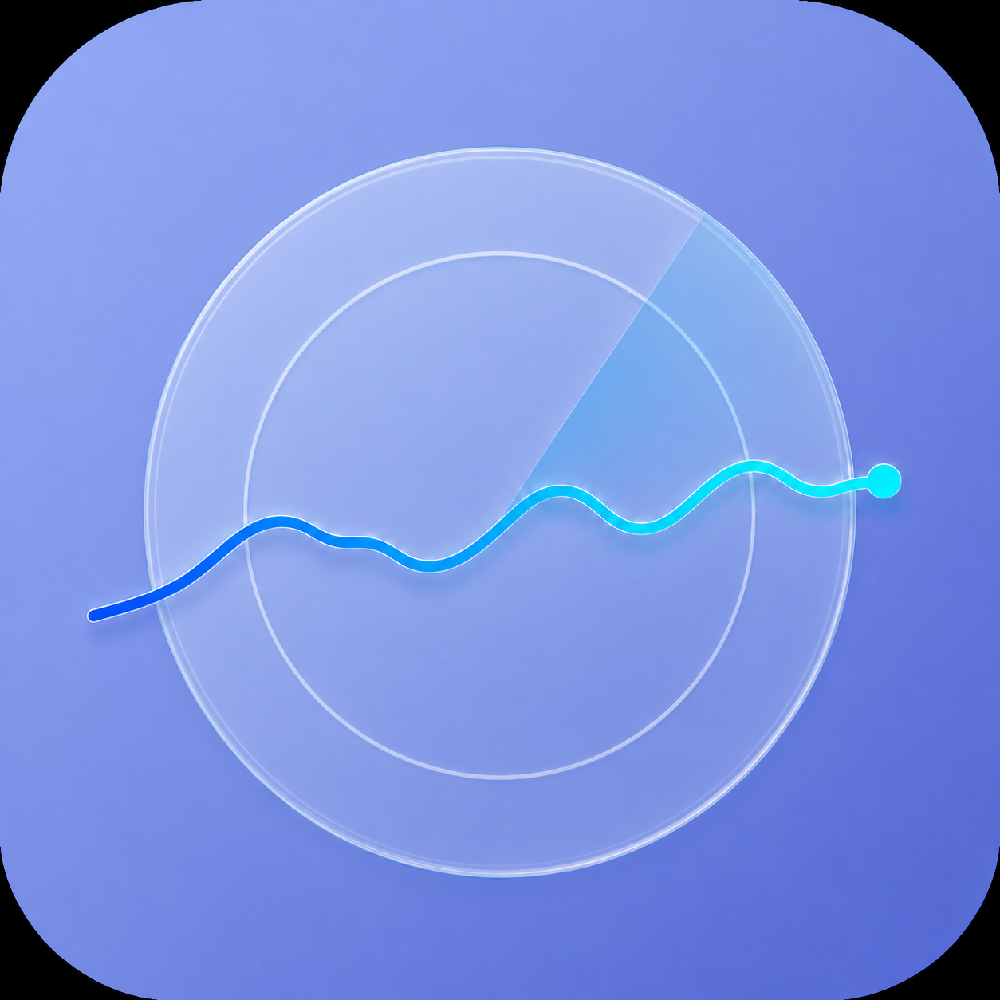
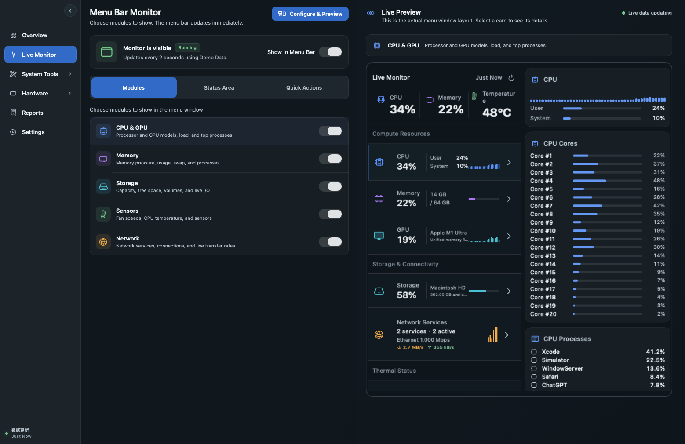
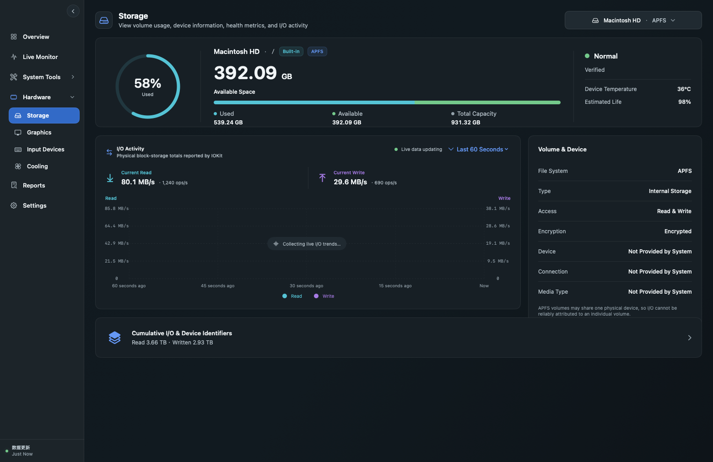
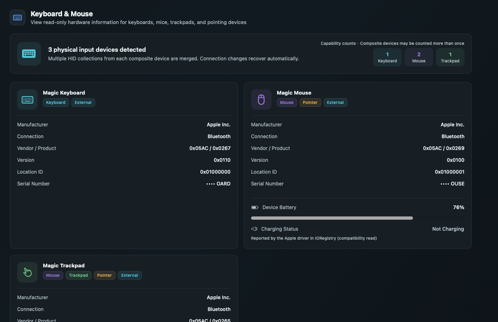
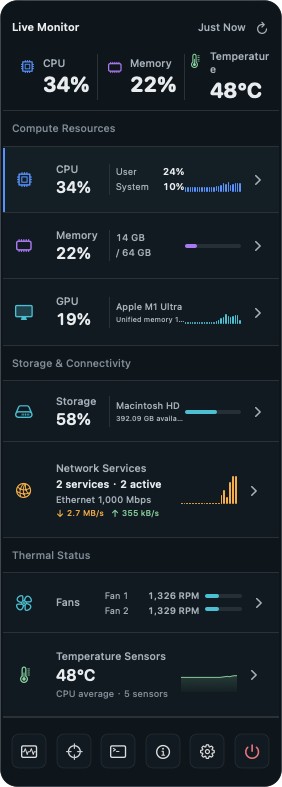

  

<h1 align="center">TraceHalo</h1>

  A free, open-source system monitor for Mac.

  
  
  
  

  <strong>English</strong> · <a href="README.zh-Hans.md">简体中文</a>

> [!IMPORTANT]
> TraceHalo is currently a Beta. The first public version is **v000.000.001**. Current `arm64` downloads run on Apple silicon Macs. Because the early Beta is not yet notarized by Apple, macOS may ask you to confirm the first launch.

## Your Mac, at a glance

TraceHalo brings the information you normally have to look for across several macOS screens into one place. Keep a small live summary in the menu bar, then open the details only when you need them.

- See CPU, GPU, memory, storage, network, fan, and temperature activity
- Find busy CPU cores and high-usage processes
- Check storage space, disk activity, and available device health information
- Inspect displays, graphics, keyboards, mice, and trackpads
- View charge, charging state, cycles, and battery health on MacBooks
- Choose exactly what appears in the menu bar
- Switch between English and Simplified Chinese, light and dark appearance

When macOS or the hardware does not provide a value, TraceHalo shows it as unavailable. It does not invent a value.

TraceHalo does **not** clean disks, manage SSD TRIM, control fans, record keystrokes, or track pointer movement.

## See TraceHalo

### Configure a live menu bar monitor

Choose the information you care about and preview the result immediately.

### Check storage and disk activity

See available space, volume information, current read/write activity, and recent I/O history.

### Inspect connected input devices

Battery and charging information appears only when the device reports it to macOS.

### Open details from the menu bar

Closing the main window does not stop the menu bar monitor.

  

## Download and install

TraceHalo requires **macOS 14 or later**.

1. Open the [Releases page](https://github.com/ShawnShoper/TraceHalo/releases).
2. Download the newest ZIP for your Mac. The current Apple silicon package is named like `TraceHalo-v000.000.001-macOS-arm64-adhoc.zip`.
3. Double-click the ZIP, then drag **TraceHalo.app** into **Applications**.
4. Open TraceHalo from the Applications folder.

If the Releases page has no download yet, the public Beta package has not been uploaded.

### If macOS says Apple cannot verify TraceHalo

The early Beta uses an ad-hoc signature while Apple Developer enrollment is being completed. Only continue if you trust where the package came from.

1. Open **Applications** in Finder.
2. Hold `Control`, click **TraceHalo**, and choose **Open**.
3. Choose **Open** again in the confirmation window.
4. If that option is unavailable, open **System Settings → Privacy & Security** and choose **Open Anyway** beside the TraceHalo message.

Do not disable macOS security features or run unknown Terminal commands. This manual confirmation will no longer be needed after public builds are Developer ID signed and notarized by Apple.

## First-time setup

1. Open **Overview** and confirm that the Mac model and basic readings look correct.
2. Open **Live Monitor**, choose the modules you want, and enable the menu bar display.
3. Open **Settings** to choose the language, appearance, refresh interval, and temperature unit.
4. Open **Cooling**. If extra access is needed for fan or temperature readings, TraceHalo will explain the available read-only option.
5. Close the main window and use TraceHalo from the menu bar.

To stop TraceHalo completely, use **Quit TraceHalo Completely** or the power button at the bottom of the menu bar panel. Closing the window and `Command-Q` intentionally leave the menu bar monitor running.

## Common questions

<strong>Why can’t I see a fan or temperature?</strong>

Different Mac models expose different sensors. TraceHalo shows only data it can read reliably. On supported models, it can offer an optional read-only sensor service when normal access is unavailable.

<strong>Why is there no Battery page on my desktop Mac?</strong>

TraceHalo hides battery-only controls when no built-in battery is detected. It also avoids showing an estimated whole-machine input-power value when macOS does not provide a trustworthy reading.

<strong>Does TraceHalo record keyboard or mouse activity?</strong>

No. It reads device information only. It does not record keystrokes or track pointer movement.

<strong>Does TraceHalo upload my system information?</strong>

No telemetry upload is built into the app. Monitoring data stays on the Mac. Reports are exported only when you choose to save them and hide sensitive identifiers by default.

<strong>How do I change the language?</strong>

Open **Settings → Application Language**. The default follows macOS; unsupported system languages fall back to English. You can also select English or Simplified Chinese directly.

## Privacy and support

Normal monitoring is read-only. Features that can change the system always require a review and confirmation; related application files are unselected by default.

When reporting a problem, include your Mac model, macOS version, the affected page, and whether the value is missing or incorrect. Do not post unredacted serial numbers, network addresses, personal file paths, or system reports.

For source builds and tests, see [Development Guide](DEVELOPMENT.md). For release signing and package verification, see [Distribution Guide](DISTRIBUTION.md). Contributions are described in [CONTRIBUTING.md](CONTRIBUTING.md).

## License

TraceHalo is licensed under the [Apache License 2.0](LICENSE).

TraceHalo is independently implemented and is not affiliated with, endorsed by, or based on the private source code of Sensei or Cindori.
