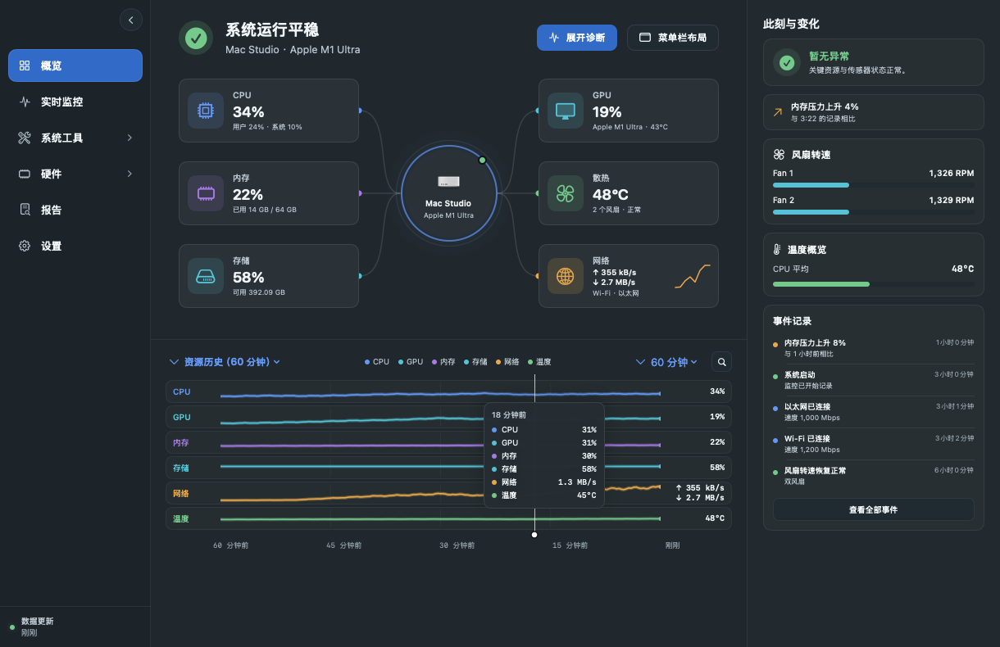
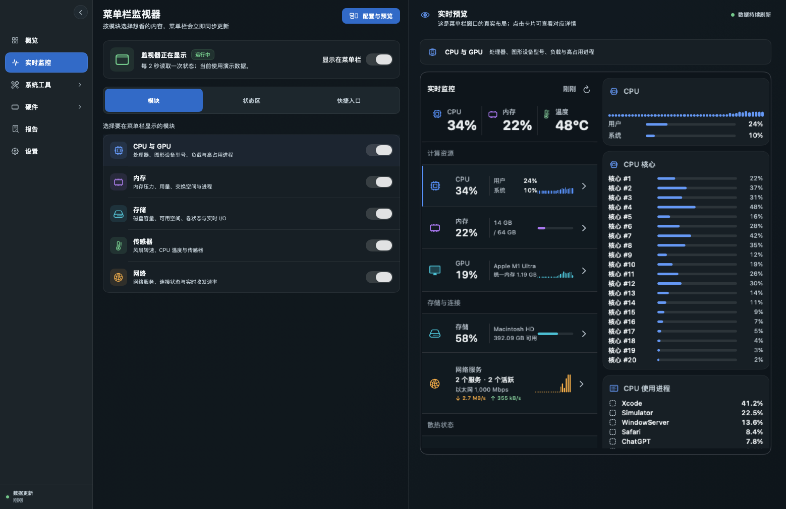
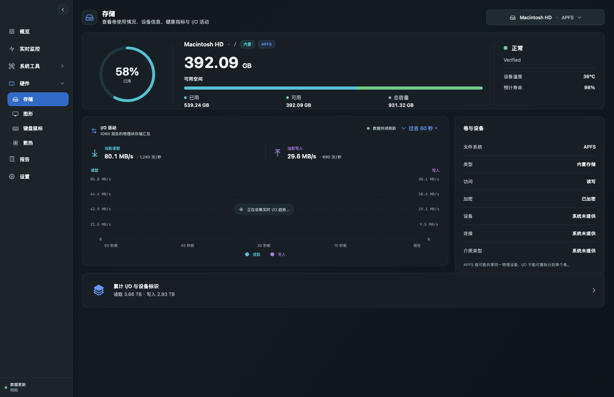
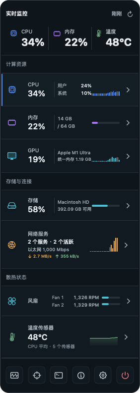

  

<h1 align="center">TraceHalo</h1>

  一款免费、开源、专为 Mac 设计的系统监控工具。

  
  
  
  

  <a href="README.md">English</a> · <strong>简体中文</strong>

> [!IMPORTANT]
> TraceHalo 目前处于 Beta 阶段，首个公开版本为 **Beta v0.0.1**。当前 `arm64` 安装包仅支持 Apple 芯片 Mac。由于早期 Beta 尚未完成 Apple 公证，macOS 第一次启动时可能要求手动确认。

## 一眼看懂你的 Mac

TraceHalo 把原本分散在多个 macOS 页面里的系统信息集中到一起。你可以在菜单栏常驻一小块实时状态，需要时再打开详细信息。

- 查看 CPU、GPU、内存、存储、网络、风扇和温度
- 找到高负载 CPU 核心和高占用进程
- 查看磁盘空间、读写活动和系统能够提供的设备健康信息
- 查看显示器、显卡、键盘、鼠标和触控板信息
- 在 MacBook 上查看电量、充电状态、循环次数和电池健康
- 自由选择菜单栏显示哪些信息
- 支持简体中文、英文，以及浅色和深色外观

如果 macOS 或硬件没有提供某项数据，TraceHalo 会明确显示“不可用”，不会用猜测值冒充真实数据。

TraceHalo **不包含**磁盘清理、SSD TRIM 管理、风扇控制、按键记录或鼠标轨迹记录。

## 界面预览

### 查看 Mac 整体状态

首页把 CPU、GPU、内存、存储、网络和散热集中显示在一起。

### 自定义菜单栏监控

选择自己关心的信息，右侧会立即预览最终效果。

### 查看存储和磁盘活动

查看剩余空间、卷信息、当前读写速度和最近的 I/O 变化。

### 从菜单栏展开详情

关闭主窗口后，菜单栏监控仍会继续运行。

  

## 下载和安装

TraceHalo 需要 **macOS 14 或更高版本**。

1. 打开 [Releases 下载页面](https://github.com/ShawnShoper/TraceHalo/releases)。
2. 下载适合自己 Mac 的最新 ZIP。当前 Apple 芯片安装包名称类似 `TraceHalo-v000.001.000-macOS-arm64-adhoc.zip`。
3. 双击 ZIP 解压，再把 **TraceHalo.app** 拖入“应用程序”文件夹。
4. 从“应用程序”文件夹启动 TraceHalo。

如果 Releases 页面暂时没有安装包，说明公开 Beta 还没有上传。

### 遇到“Apple 无法验证 TraceHalo”怎么办？

早期 Beta 在 Apple Developer 申请完成前使用 ad-hoc 签名。只有在你确认安装包来源可信时，才继续下面的操作。

1. 在 Finder 中打开“应用程序”。
2. 按住 `Control` 点击 **TraceHalo**，选择“打开”。
3. 在确认窗口中再次选择“打开”。
4. 如果没有这个选项，前往“系统设置 → 隐私与安全性”，找到 TraceHalo 提示并选择“仍要打开”。

不要关闭 macOS 安全功能，也不要执行来源不明的终端命令。公开安装包完成 Developer ID 签名和 Apple 公证后，就不再需要手动确认。

## 第一次使用

1. 打开“概览”，确认 Mac 型号和基础数据是否正确。
2. 打开“实时监控”，选择想展示的模块，然后开启菜单栏显示。
3. 打开“设置”，选择应用语言、外观、刷新频率和温度单位。
4. 打开“散热”。如果风扇或温度需要额外访问，TraceHalo 会说明可以启用的只读方案。
5. 关闭主窗口，之后可以直接从菜单栏使用 TraceHalo。

如果想完全停止 TraceHalo，请使用“彻底退出 TraceHalo”，或者菜单栏面板底部的电源按钮。关闭窗口和 `Command-Q` 会继续保留菜单栏监控，这是当前产品的预期行为。

## 常见问题

<strong>为什么看不到风扇或温度？</strong>

不同 Mac 开放的传感器不同。TraceHalo 只显示能够可靠读取的数据。在支持的设备上，如果普通方式无法读取，它会提供可选的只读传感器服务。

<strong>为什么台式 Mac 没有电池页面？</strong>

检测不到内置电池时，TraceHalo 会自动隐藏仅适用于电池的页面。如果 macOS 没有提供可信的整机输入功率，应用也不会显示估算值。

<strong>TraceHalo 会记录键盘或鼠标操作吗？</strong>

不会。TraceHalo 只读取设备信息，不记录按键，也不追踪鼠标移动。

<strong>TraceHalo 会上传我的系统信息吗？</strong>

应用没有遥测上传功能，监控数据保留在本机。系统报告只有在你主动保存时才会导出，并且默认隐藏敏感标识。

<strong>怎么切换语言？</strong>

打开“设置 → 应用语言”。默认跟随 macOS；不支持的系统语言会自动使用英文，也可以手动选择 English 或简体中文。

## 隐私与问题反馈

普通监控功能只读。可能修改系统的功能一定会先让你审阅并确认，应用关联文件默认不勾选。

反馈问题时，请提供 Mac 型号、macOS 版本、发生问题的页面，以及数据是“缺失”还是“错误”。请勿公开未经脱敏的序列号、网络地址、个人文件路径或系统报告。

源码构建和测试说明请查看[开发指南](DEVELOPMENT.md)，安装包签名和校验说明请查看[分发指南](DISTRIBUTION.md)，参与项目请查看[贡献指南](CONTRIBUTING.md)。

## 开源许可证

TraceHalo 使用 [Apache License 2.0](LICENSE)。

TraceHalo 为独立实现，与 Sensei、Cindori 不存在隶属或授权关系，也没有使用其私有源代码。
